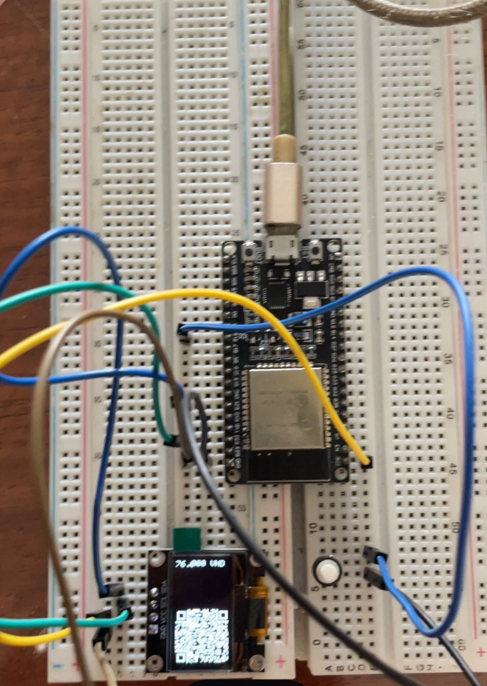

A simple demo to show the QRCode for QRPay on a 0.96" OLED display

Connect ESP32 on the same network with server

## Demo

## Features

- **Fetch QRCode from server:** The ESP32 connects to a server to retrieve dynamic QR codes, suitable for applications that require frequent updates or online authentication.
- **Generate QRCode offline:** The device can generate QR codes locally on the ESP32 without a network connection, ideal for fixed content or as a backup when offline.

## Limitations

- **Display size:** The 0.96" OLED screen limits the QR code resolution, so only short content QR codes are recommended.
- **Functionality:** Currently, only the amount can be updated. Changing the bank or account number has not been implemented yet.

## TODO

- Support changing bank and account number dynamically. (locally)
- Add configuration interface (web or serial) for easier setup.
- Add error handling and status display on OLED.
- Optimize memory usage for larger QR codes.